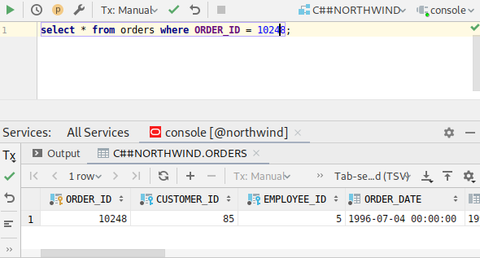

Database row search and navigation using primary and foreign key constaints.

# Motivation

When there is need to examine specific row in the database people usually write `SELECT` queries:

`Db-tree` eleminates the need to write SQL queries by hand: just paste any key value in the text field and hit `Enter` key!

See [wiki](https://github.com/vzhn/db-tree-fx/wiki/Usage) for detailed information

Supported databases:
* oracle
* postgres
* MariaDB

# Download
Supported platforms:
* GNU/Linux x86_64 rpm and deb packages
* Windows x86_64
* macOS  

See [latest release packages](https://github.com/db-tree/db-tree-fx/releases/latest)
