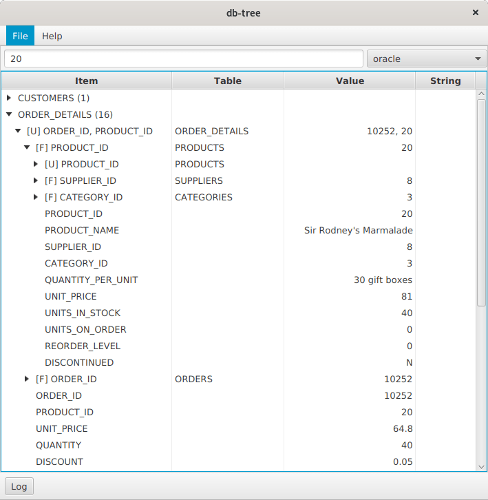

Database row search and navigation using primary and foreign key constaints.

See [wiki](https://github.com/vzhn/db-tree-fx/wiki/Usage) for detailed information

The first release is planned in November. Stay tuned!
